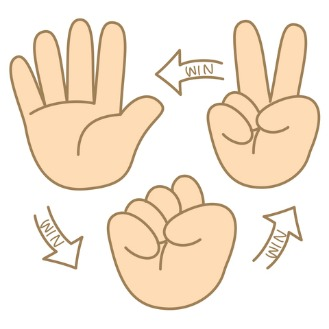

# Rock Paper Scissors - Python text-based take on a classic school yard game!

Pick your weapon and play against the computer - you'll only get a virtual sting if you lose!

The rules are the same as the classic gamne:
1. Paper covers Rock
2. Scissors cut Paper
3. Rock smashes Scissors

Choose your weapon wisely! Don't like the computer win!

## Built with:
<ul>
<li>Python3</li></ul>

## Installation, etc
CD to the location of your choice, and then git clone. Hack away!
[Git Clone](https://github.com/kgooderhodges/hodges_k_pythonHW.git)

### Author
Katie Hodges

Enjoy!